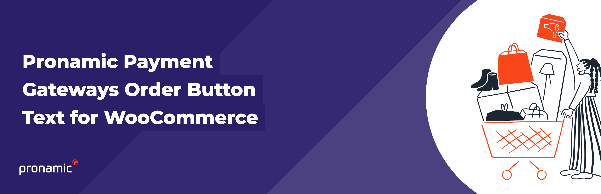

<p align="center"></p>

# Pronamic Payment Gateways Order Button Text for WooCommerce

[](https://packagist.org/packages/pronamic/pronamic-payment-gateways-order-button-text-for-woocommerce)
[](https://packagist.org/packages/pronamic/pronamic-payment-gateways-order-button-text-for-woocommerce)
[](https://packagist.org/packages/pronamic/pronamic-payment-gateways-order-button-text-for-woocommerce)
[](https://packagist.org/packages/pronamic/pronamic-payment-gateways-order-button-text-for-woocommerce)
[](https://packagist.org/packages/pronamic/pronamic-payment-gateways-order-button-text-for-woocommerce)

- [Introduction](#introduction)
- [Benefits](#benefits)
- [Installation](#installation)
  - [Composer](#composer)
- [Screenshots](#screenshots)
- [Examples](#examples)
- [Links](#links)

## Introduction

This WordPress plugin adds a setting to all WooCommerce gateways for
customizing the order button text. This allows you to adjust the standard
"Pay for order" button text per WooCommerce gateway. For webshops where
ordering also results in a payment obligation, it is sometimes mandatory to
state this on the order button. This can be done by, for example, changing the
order button text to "Order with payment obligation".

## Benefits

This simple, high-quality plugin adds a setting to all WooCommerce payment gateways to customize the order button text.
The plugin was built by the Frisian/Dutch web agency Pronamic with WordPress experience since 2005.
Users of this plugin can count on Pronamic's excellent service and experience.

## Installation

### Composer

```
composer require pronamic/pronamic-payment-gateways-order-button-text-for-woocommerce
```

## Screenshots


## Examples

### English

- Pay for order
  - [translate.wordpress.org - `nl`](https://translate.wordpress.org/projects/wp-plugins/woocommerce/stable/nl/default/?filters%5Bstatus%5D=either&filters%5Boriginal_id%5D=580015&filters%5Btranslation_id%5D=23198747)
- Proceed to PayPal
  - [translate.wordpress.org - `nl`](https://translate.wordpress.org/projects/wp-plugins/woocommerce/stable/nl/default/?filters%5Bstatus%5D=either&filters%5Boriginal_id%5D=579630&filters%5Btranslation_id%5D=51078485)
- Order and pay
- Order with payment obligation
- Proceed to iDEAL and pay

### Dutch

- Betaal voor bestelling
- Ga verder naar PayPal
- Bestel en betaal
- Bestellen met betalingsverplichting
- Ga verder naar iDEAL en betaal

## Links

- https://www.acm.nl/nl/verkoop-aan-consumenten/checklist-online-verkoop
